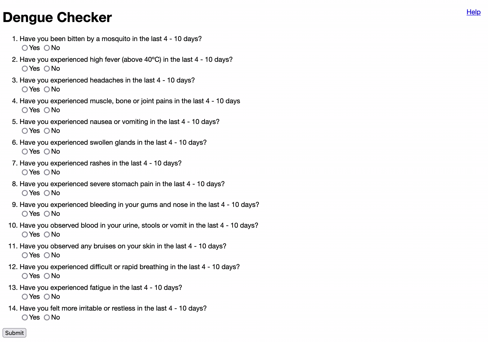

# Damegue - dengue checker

Damegue is a dengue checker website which determines your chances of having dengue, based on your answers to the questions.
In addition, it checks for dengue clusters near you (available only in Singapore).

This program is developed by [Meng Shin](https://github.com/LimMengShin), [Ping Jin](https://github.com/minholly1993) and [Ysabelle Wong](https://github.com/ysabelle2006) for our 2022 Secondary 4 Computing+ Coursework.

### Demo



## Installation

Begin by cloning this git repo and navigating to the project directory on the command line.

> Refer to [this](https://docs.github.com/en/repositories/creating-and-managing-repositories/cloning-a-repository) guide on how to clone a git repository on GitHub.

Ensure that [Python](https://www.python.org/downloads/) and [PIP](https://pip.pypa.io/en/stable/installation/) are installed in your system.

Next, also on the command line, install dependencies by running:

```
pip install -r requirements.txt
```

## Usage

Run the programme in your preferred IDE.

Afterwards, navigate to `http://127.0.0.1:5000/` on your web browser to access the website.

To quit the program, press `CTRL + C` on Terminal.